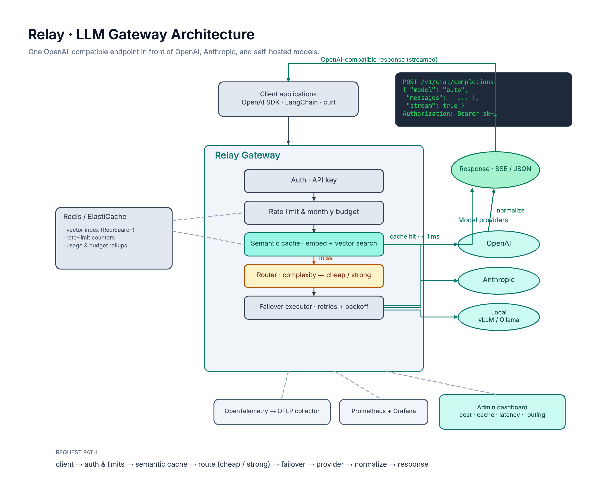
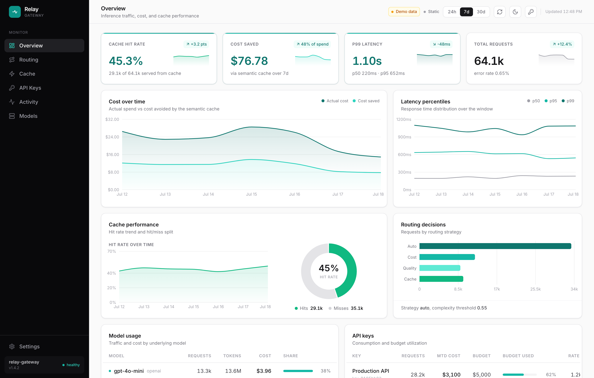
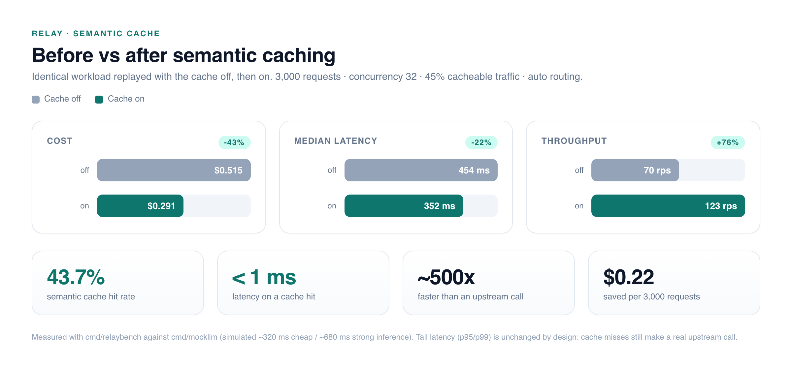

<div align="center">

# Relay

**A high-performance, OpenAI-compatible LLM gateway and semantic router.**

One endpoint in front of OpenAI, Anthropic, and self-hosted models, with semantic
caching, cost- and complexity-aware routing, automatic failover, per-key budgets,
and full observability.

[](https://github.com/AymanYouss/relay/actions/workflows/ci.yml)
[](https://go.dev)
[](LICENSE)
[](https://github.com/AymanYouss/relay/pkgs/container/relay)

</div>

---

## Why Relay

Teams wire the OpenAI SDK straight into production and inherit every operational
gap that comes with it: no shared cache, no cost controls, no failover when a
provider has a bad five minutes, and no single place to see spend or latency.
Relay is a drop-in OpenAI-compatible endpoint that closes those gaps without
changing a line of application code, just point your SDK's `base_url` at it.

> **On a repeat-heavy workload, enabling semantic caching cut cost by 43% and
> lifted throughput 76%, with cache hits served in under 1 ms versus ~500 ms for
> a live completion.** See [benchmarks](docs/benchmarks.md).

<div align="center">

</div>

## Highlights

- **One OpenAI-compatible API** for every provider. Existing OpenAI SDKs, LangChain,
  and `curl` work unchanged, including full **SSE streaming** passthrough. Anthropic's
  Messages API and streaming events are normalized to the OpenAI shape.
- **Semantic cache.** Each prompt is embedded and matched against prior prompts by
  vector similarity, so semantically equivalent requests (not just byte-identical
  ones) are served from cache. Backed by Redis (RediSearch) with a pluggable
  `VectorStore` interface.
- **Complexity-aware routing.** Cheap models for easy prompts, strong models for hard
  ones, chosen by a fast heuristic classifier, plus `cost` and `quality` overrides.
- **Retries and failover.** Bounded retries with exponential backoff and jitter, and
  per-model fallback chains across providers.
- **Budgets, rate limits, accounting.** Per-API-key requests-per-minute limits,
  monthly spend budgets, and token/cost accounting.
- **Observability.** OpenTelemetry tracing across the request path, Prometheus
  metrics, a Grafana dashboard, and a built-in admin console.

## Admin console

A shipped-quality dashboard (embedded in the binary) for cost, cache hit rate,
latency percentiles, routing decisions, and per-key usage.

<div align="center">

</div>

## Quickstart

### Docker Compose (gateway + Redis Stack + Prometheus + Grafana)

```bash
git clone https://github.com/AymanYouss/relay.git
cd relay
export OPENAI_API_KEY=sk-...          # optional for cached/local-only use
export ANTHROPIC_API_KEY=sk-ant-...
docker compose up --build
```

- Gateway API: `http://localhost:8080`
- Admin console + metrics: `http://localhost:9090`
- Grafana: `http://localhost:3000`

### Local (Go)

```bash
cp relay.example.yaml relay.yaml     # then edit / set env vars
make web                             # build + embed the dashboard
make run                             # or: go run ./cmd/relay -config relay.yaml
```

### Call it like OpenAI

```bash
curl http://localhost:8080/v1/chat/completions \
  -H "Authorization: Bearer sk-relay-team-a" \
  -H "Content-Type: application/json" \
  -d '{
    "model": "auto",
    "messages": [{"role": "user", "content": "Explain semantic caching in one sentence."}],
    "stream": true
  }'
```

```python
from openai import OpenAI

client = OpenAI(base_url="http://localhost:8080/v1", api_key="sk-relay-team-a")
resp = client.chat.completions.create(
    model="auto",                     # or "cost", "quality", or a pinned model
    messages=[{"role": "user", "content": "Summarize the CAP theorem."}],
)
print(resp.choices[0].message.content)
```

Every response carries a `relay` metadata block describing what happened:

```json
"relay": {
  "cache_hit": false,
  "routed_model": "gpt-4o-mini",
  "routed_provider": "openai",
  "route_reason": "auto: low complexity",
  "cost_usd": 0.00042,
  "attempts": 1
}
```

## How it works

A request flows through a single, ordered pipeline:

```
client → auth & limits → semantic cache → route (cheap / strong) → failover → provider → normalize → response
```

1. **Auth, rate limit, budget.** The API key is resolved to a principal; its
   per-minute rate limit and monthly budget are enforced.
2. **Semantic cache.** The prompt is embedded and looked up by cosine similarity
   within a per-model namespace. Above the similarity threshold, the cached
   response is returned (streamed clients get a synthesized SSE stream).
3. **Routing.** On a miss, a heuristic classifier scores prompt complexity and
   picks the cheap or strong model (or honors a `cost` / `quality` / pinned choice).
4. **Failover.** The router's chain (primary + fallbacks) is executed with bounded
   retries and backoff; transient errors advance to the next provider.
5. **Normalize, cache, account.** The provider response is normalized to the
   OpenAI shape, stored in the cache, and recorded for cost and analytics.

Model routing, pricing, providers, budgets and cache behavior are all declared in
[`relay.example.yaml`](relay.example.yaml).

## Deployment

| Target | Where |
| --- | --- |
| Container image | multi-stage [`Dockerfile`](Dockerfile) → distroless, ships as a single binary with the dashboard embedded |
| Local stack | [`docker-compose.yml`](docker-compose.yml) |
| Kubernetes | [`deploy/k8s`](deploy/k8s) — Deployment, HPA, PDB, ServiceMonitor, ALB Ingress, Redis Stack |
| AWS | [`deploy/aws`](deploy/aws) — Terraform for EKS, ElastiCache, and the AWS Load Balancer Controller |
| CI/CD | [`.github/workflows/ci.yml`](.github/workflows/ci.yml) — vet, race tests, lint, dashboard build, image publish to GHCR |

## Observability

- **Metrics** at `/metrics` (admin port): request rate, cache hit rate, latency
  histograms, spend, tokens, retries, and failovers. A Grafana dashboard is
  provisioned in [`deploy/grafana`](deploy/grafana).
- **Tracing** via OpenTelemetry (OTLP), spanning cache lookup, routing, and each
  upstream attempt.
- **Analytics API** at `/admin/api/dashboard` powers the built-in console.

## Benchmarks

Reproducible harness in [`cmd/relaybench`](cmd/relaybench) + [`cmd/mockllm`](cmd/mockllm).
Full methodology and results: [docs/benchmarks.md](docs/benchmarks.md).

<div align="center">

</div>

## Project layout

```
cmd/relay        gateway entrypoint
cmd/relaybench   load generator / benchmark harness
cmd/mockllm      OpenAI-compatible mock upstream for benchmarking
internal/
  apitypes       OpenAI-compatible wire types
  provider       provider adapters (OpenAI, Anthropic, local) + streaming
  cache          semantic cache + pluggable vector store (Redis, in-memory)
  embed          embedding clients
  router         complexity classifier, routing, failover executor
  auth           API-key authentication
  ratelimit      per-key rate limiting (Redis, in-memory)
  usage          pricing, budgets, accounting, dashboard analytics
  telemetry      OpenTelemetry tracing + Prometheus metrics
  gateway        request pipeline
  server         HTTP API, SSE, admin API, embedded dashboard
web/             admin dashboard (React + TypeScript + Vite)
deploy/          Docker, Kubernetes, AWS, Grafana, Prometheus, OTel
```

## Development

```bash
make test     # go test -race with coverage
make bench    # Go benchmarks
make vet      # go vet
make lint     # golangci-lint
make web-dev  # dashboard dev server
```

## License

[MIT](LICENSE)
